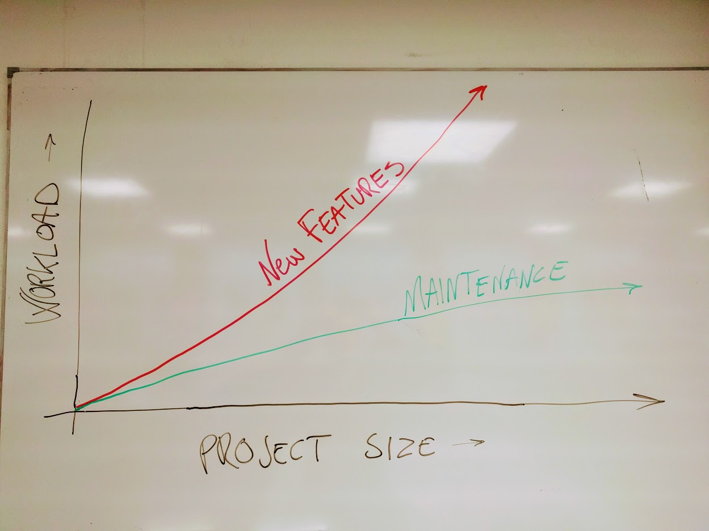

## Contents

1. [Changelog - Iterations](#content1)
2. [Homegrown assets](#content2)
3. [ Git reference](#content3)
4. [Unity reference](#content4)
5. [Discussion](#content5)

&nbsp;

## Changelog - Iterations

### Version 0.4 - not released

*Release date: TBD*
*Cycle length: 4 days*

- Mouse aiming
- Main character head sprite
- HUD with scoring and timer
- Fancy main menu with sound options
- Weapon pickups
- New enemy type: The Jumper
- Sugarkick mechanic - slows down time speeds up player

&nbsp;

### Version 0.3

*Release date: 21.11.2016*
*Cycle length: 4 days*

- Player can shoot bullets.
- Player can kill enemies.
- Enemy spawner can spawn/respawn enemies in different ways.
    + Wave spawn
    + Static spawn
    + Endless spawn
- Enemies falls of the map.
- Enemies can kill player.
- Player hit animation added
- Enemy killed animation added
- Holes in the map added
- All levels can be loaded from menu.
- All levels are chained together so that one level starts after the other is finished.

&nbsp;

### Version 0.2

*Released: 17. november*
*Cycle length: 6 days*

- Created an enemy spawner.
- Player can fall off the map.
- Player fall animation.
- Main menu created. Can launch the Octagon level.
- Player now has the same speed in all directions.
- Xbox 360 Controller support for Windows.

&nbsp;

### Version 0.1

*Released 11. november*
*Cycle length: 5 days*

- Basic player movement with keyboard.
- Dummy movement animation.
- Gun rotation
- A single enemy that chases the player.
- Octagon, Hexagon, Square and Triangle levels created.

&nbsp;
&nbsp;

## Discussion

__Progress as a function of time__

As the project grew bigger we started to notice that more work had to be done just to maintain the project. Also the amount of work that had to be done to add new features became harder and harder. The main reson for this is that all the game-systems are interconnected, and if you change one part of the game, it will effect more and more parts of the rest of the game, as the game grows. This concept is illustrated on the whiteboard below:

__SCRUM - fast iterations, always finished/never finished__

The method for managing the project was chosen to be an informal type of the Scrum method.  Using GitHub extensively we were able to at least do the fast iterations part very well. GitHubs issue tracking system is also excellent for this way of project management. If implemented well into the project, the issue tracking system makes sure that every team member can find work to do in an easy way.

GitHub makes us able to work decentralized, and keeps the pace of the project at a certain speed, no matter where each team member is located. Still, it is worth mentioning that frequent meetings are needed to maintin progress speed. New issues has to be made, knowledge has to be transferred, and there is no better way than a good old fashioned meeting.

__The singleplayer -> multiplayer transition problem__

- Code written for single player is a intervined web of dependencies.
- Huge job, big risk, might be better to fork a separate repo.
- Multiplayer from the start, or no multiplayer.

&nbsp;
&nbsp;

## Homegrown assets

#### Unity Prefabs

- BulletDestruction
- BulletPrefab
- BulletParent
- Camera
- Edge
- Gun
- Hole
- Particle system
- Player
- Spawner 1
- Spawner 2
- TestEnemy 1

#### Unity Animations

- EnemyDeath
- EnemyFallDown
- PlayerFallDown
- PlayerHurt
- PlayerIdle
- PlayerSprite
- PlayerWalk
- Sugarkick
- TestEnemy
- TestEnemyIdle
- TestEnemyWalk
- TestPlayer

#### Sounds

- Background music     = klar
- Meny music           = klar
- Weapon 1 sound       = klar
- Weapon 1 smash sound = klar
- Weapon 2 sound       = klar
- Weapon 2 smash sound = klar
- Press button sound   = klar
- Introduce sound      = klar ( når spilleren hopper fra menyen og inn i spillet )
- Walking sound        = klar

#### Sprites

- 2gon, 3gon, 4gon, 6gon, 8gon
- Gun
- Hole
- Main char front
- Main char back
- Player test sheet

&nbsp;
&nbsp;

## Git reference

The group was motivated to use GitHub extensively from the start. 4/5 members contributed actively with each their branch, making pull requests to the master branch. 3 of the members had never used Git/GitHub before. The learning curve was steep. Below are a selection of the commands we had to learn.

> git init                                        
  git clone *__url__*                             
  git checkout *__branch/commit id__*             
  git merge *__branch/commit id__*                  
  git branch                                      
  git branch -m                                   
  git branch -D                                     
  git fetch                                       
  git push origin *__branch__*                    
  git pull origin *__branch__*                      
  git log                                         
  git log --graph                                 
  git log --pretty=oneline                        
  git diff                                          
  git remote show origin                          
  git remote add *__url__*                        
  git remote -v                                     
  git add .                                       
  git add *__filename(s)__*                       
  git commit                                      
  git commit -m "*__message__*"                   
  git tag                                         
  git tag -a *__version__* *__commit id__*        
  git tag -a *__version__* -m *__message__*         
  git revert *__commit id__*                      
  git reset --hard                                
  git reset --hard *__tag/branch/commit id__*     
  git reset HEAD~                                 
  git rm *__file__*                               
  git mv *__filefrom fileto__*                      
  git config --list                               
  git config --global user.name "*__name__*"      
  git config --global user.email *__email__*      
  git config --global core.editor *__app-path__* --wait  

&nbsp;
&nbsp;

## Unity reference

References to Unity's standard library assets that are used in this project

__Classes__  
 >[Object](https://docs.unity3d.com/ScriptReference/Object.html)  
 [GameObject](https://docs.unity3d.com/ScriptReference/GameObject.html) 
 [Transform](https://docs.unity3d.com/ScriptReference/Transform.html)   
 [Vector2](https://docs.unity3d.com/ScriptReference/Vector2.html)       
 [Vector3](https://docs.unity3d.com/ScriptReference/Vector3.html)       
 [Quaternion](https://docs.unity3d.com/ScriptReference/Quaternion.html)  
 [Rigidbody2D](https://docs.unity3d.com/ScriptReference/Rigidbody2D.html)  
 [BoxCollider2D](https://docs.unity3d.com/ScriptReference/BoxCollider2D.html)  
 [Sprite](https://docs.unity3d.com/ScriptReference/Sprite.html)  
 [SpriteRenderer](https://docs.unity3d.com/ScriptReference/SpriteRenderer.html)  
 [Material](https://docs.unity3d.com/ScriptReference/Material.html)  
 [RenderTexture](https://docs.unity3d.com/ScriptReference/RenderTexture.html)  
 [Shader](https://docs.unity3d.com/ScriptReference/Shader.html)  
 [Text](https://docs.unity3d.com/ScriptReference/UI.Text.html)  
 [Animator](https://docs.unity3d.com/ScriptReference/Animator.html)  
 [Camera](https://docs.unity3d.com/ScriptReference/Camera.html)  
 [Input](https://docs.unity3d.com/ScriptReference/Input.html)  
 [Debug](https://docs.unity3d.com/ScriptReference/Debug.html)  

  

 __Variables__  
 >[Quaternion Quaternion.identity](https://docs.unity3d.com/ScriptReference/Quaternion-identity.html)  
 [Transform Transform.parent](https://docs.unity3d.com/ScriptReference/Transform-parent.html)  
 [Sprite SpriteRenderer.sprite](https://docs.unity3d.com/ScriptReference/SpriteRenderer-sprite.html)  
 [Renderer.sharedMaterial](https://docs.unity3d.com/ScriptReference/Renderer-sharedMaterial.html)  
 [Vector3 Transform.position](https://docs.unity3d.com/ScriptReference/Transform-position.html)  
 [float Vector2.magnitude](https://docs.unity3d.com/ScriptReference/Vector2-magnitude.html)  
 [float Camera.orthographicSize](https://docs.unity3d.com/ScriptReference/Camera-orthographicSize.html)  
 [float Rigidbody2D.velocity](https://docs.unity3d.com/ScriptReference/Rigidbody2D-velocity.html)  
 [float Time.deltaTime](https://docs.unity3d.com/ScriptReference/Time-deltaTime.html)  
 [float Time.timeScale](https://docs.unity3d.com/ScriptReference/Time-timeScale.html)  
 [float Input.GetAxis](https://docs.unity3d.com/ScriptReference/Input.GetAxis.html)  
 [float Input.GetAxisRaw](https://docs.unity3d.com/ScriptReference/Input.GetAxisRaw.html)  
 [Vector3 Input.mousePosition](https://docs.unity3d.com/ScriptReference/Input-mousePosition.html)  

  

 __Functions__  
 >[GameObject.CompareTag(String tag) -> bool](https://docs.unity3d.com/ScriptReference/GameObject.CompareTag.html)  
 [GameObject.Find(String name) -> GameObject](https://docs.unity3d.com/ScriptReference/GameObject.Find.html)  
 [Component.GetComponent&lt;ComponentName&gt;() -> Component](https://docs.unity3d.com/ScriptReference/Component.GetComponent.html)  
 [Component.GetComponentInParent&lt;ComponentName&gt;() -> Component](https://docs.unity3d.com/ScriptReference/Component.GetComponentInParent.html)  
 [Component.GetComponentInChildren&lt;ComponentName&gt;() -> Component](https://docs.unity3d.com/ScriptReference/Component.GetComponentInChildren.html)  
 [Object.Destroy(Object)](https://docs.unity3d.com/ScriptReference/Object.Destroy.html)  
 [Object.Instantiate(Object original) -> Object](https://docs.unity3d.com/ScriptReference/Object.Instantiate.html)  
 [Camera.ViewportToWorldPoint(Vector3 position) -> Vector3](https://docs.unity3d.com/ScriptReference/Camera.ScreenToWorldPoint.html)  
 [Transform.Rotate(Vector3)](https://docs.unity3d.com/ScriptReference/Transform.Rotate.html)  
 [Rigidbody2D.AddForce(Vector2)](https://docs.unity3d.com/ScriptReference/Rigidbody2D.AddForce.html)  
 [Quaternion.Euler(float x, float y, float z) -> Quaternion](https://docs.unity3d.com/ScriptReference/Quaternion.Euler.html)  
 [Vector3.RoateTowards -> Vector3](https://docs.unity3d.com/ScriptReference/Vector3.RotateTowards.html)  
 [Material.CopyPropertiesFromMaterial(Material other)](https://docs.unity3d.com/ScriptReference/Material.CopyPropertiesFromMaterial.html)  
 [Material.SetTexture(string propertyName, Texture)](https://docs.unity3d.com/ScriptReference/Material.SetTexture.html)  
 [Shader.Find(String name) -> Shader](https://docs.unity3d.com/ScriptReference/Shader.Find.html)  
 [MonoBehaviour.Awake()](https://docs.unity3d.com/ScriptReference/MonoBehaviour.Awake.html)  
 [MonoBehaviour.Start()](https://docs.unity3d.com/ScriptReference/MonoBehaviour.Start.html)  
 [MonoBehaviour.Update()](https://docs.unity3d.com/ScriptReference/MonoBehaviour.Update.html)  
 [MonoBehaviour.FixedUpdate()](https://docs.unity3d.com/ScriptReference/MonoBehaviour.FixedUpdate.html)  

__Misc__

[List.add()](https://msdn.microsoft.com/en-us/library/3wcytfd1.aspx)  
[List.Clear()](https://msdn.microsoft.com/en-us/library/dwb5h52a.aspx)  
