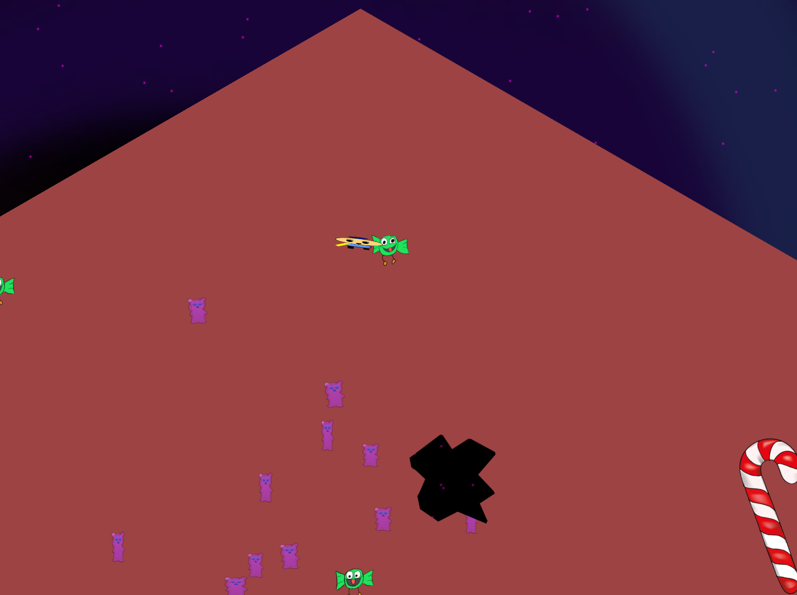

# Sugarkick! - Assignment 4 Experience Design IMT1362 @ NTNU Gjøvik

Implementation of the game Sugarkick with Unity Engine

  
## [Download latest binaries ->](https://github.com/Arxcis/Sugarkick/releases)
## [Watch "playthrough" of Octagon level ->](https://drive.google.com/file/d/0B1TL18woDGl5WThHMW1EdS1EWGc/view?usp=sharing)

 

__The Team - Oblig Destroyers__  
Jonas Solsvik          
Jone Martin Skaara     
Johannes Gabriel Aas   
Eldar Hauge Torkelsen  
Ricardo Gonzalez Q.    

## Table of Contents

1. [Changelog - Iterations](#content1)
2. [InputManagers](#content0)
3. [Homegrown assets](#content3)
4. [Git reference](#content4)
5. [Unity reference](#content5)
6. [Discussion](#content6)
  1. [Progress  VS  Project size](#content6a)
  2. [SCRUM - fast iterations, always finished/never finished](#content6b)
  3. [The singleplayer -> multiplayer transition problem](#content6c)
  4. [Modularity - Ensuring that game systems can be moved around without breaking](#content6d)
  5. [How much of the GDD was implemented?](#content6e)
  6. [How much of the GDD was not implemented?](#content6f)
  7. [Cross platform multiplayer multicontroller is not easy!](#content6g)
  8. [Some things we wish we knew about in Unity/C-sharp from the start](#content6h)
  9. [Things we wish we knew about in Git from the start](#content6i)
  10. [Unity + Git = Works surprisingly well, but…](#content6j)
  11. [Meta documentation](#content6k)

&nbsp;

## 1. Changelog - Iterations

### Version 0.5

*Release date:30.11.2016*
*Cycle length: 4 days*

- Player selection in main menu*
- Gamepad selection
- Improved edge detection.
- Many other bugfixes.
- Obstacles
- Big sound overhaul:
    + 3 different weapon sounds
    + Player hurt sound
    + Player fall sound
    + Enemy fall sound
    + Spawn sound
    + In-game music
    + Pitch deviation for all sounds
- Big sprite overhaul:
    + 4 different normal enemy Sprites
    + 2 different jumper enemy Sprites
    + Player has body sprite and head sprite in all directions.
    + Giant candy obstacle sprite.
- Damage multiplayer support
- Player movement and gun shooting multiplayer support
- New comprehensive multi-input system which supports:
    + Keyboard
    + Keyboard + mouse
    + Xbox One - tested on both Mac and Windows
    + Xbox 360 - tested on both mac and Windows
    + Up to 6 different players.

### Version 0.4

*Release date: 26.11.2016*
*Cycle length: 5 days*

- Mouse aiming
- Main character head sprite
- HUD with scoring and timer
- Fancy main menu with sound options
- Weapon pickups
- Weapon sounds
- Enemy pathfinding multiplayer support
- Camera multiplayer support
- New enemy type: The Jumper
- Sugarkick mechanic - slows down time speeds up player

&nbsp;

### Version 0.3

*Release date: 21.11.2016*
*Cycle length: 4 days*

- Player can shoot bullets.
- Player can kill enemies.
- Enemy spawner can spawn/respawn enemies in different ways.
    + Wave spawn
    + Static spawn
    + Endless spawn
- Enemies falls of the map.
- Enemies can kill player.
- Player hit animation added
- Enemy killed animation added
- Holes in the map added
- All levels can be loaded from menu.
- All levels are chained together so that one level starts after the other is finished.

&nbsp;

### Version 0.2

*Released: 17. november*
*Cycle length: 6 days*

- Created an enemy spawner.
- Player can fall off the map.
- Player fall animation.
- Main menu created. Can launch the Octagon level.
- Player now has the same speed in all directions.
- Xbox 360 Controller support for Windows.

&nbsp;

### Version 0.1

*Released 11. november*
*Cycle length: 5 days*

- Basic player movement with keyboard.
- Dummy movement animation.
- Gun rotation
- A single enemy that chases the player.
- Octagon, Hexagon, Square and Triangle levels created.

[TOC](#content)

&nbsp;
&nbsp;

## 2. InputManagers - OS specific

To make input work for gamepad controllers on your platform, replace the 'ProjectSettings/InputManager.asset'-file
with one of these files.

<a href="config/InputManager_macSierra.asset" target="´`_`blank"> Input - macSierra</a>  
<a href="config/InputManager_win10.asset" target="`_`blank">     Input - Windows10 </a>

[TOC](#content)

&nbsp;
&nbsp;

## 3. Homegrown assets
_Last updated: 02.12.2016_
We have tried to make all our assets in-house. Here is a list of what me made thus far.

#### Unity Prefabs

- Player related
  + BulletDestruction
  + BulletParent
  + BulletSeed
  + Canon
  + Player
  + Rifle
  + Spraygun
  + WeaponDrop
- UI related
  + btnBack
  + btnBLANK
  + HUD
  + NumUpDown
  + PauseMenu
  + SoundManager
  + tckBarBLANK
  + tgglBLANK
  + tgglMouseAiming
  + txtBLANK
- Camera
- caneObstacle
- Edge
- Enemy
- Gun
- Hole
- Jumper
- Particle system
- Player
- Spawner 2
- Spawn Point
- Square Map

#### Unity Animations

- EnemyDeath
- EnemyFallDown
- JumpCooldown
- JumperDeath
- JumperFallDown
- JumperLand
- JumperMidAir
- JumperTakoff
- PlayerFallDown
- PlayerHurt
- PlayerIdle
- PlayerWalk
- Sugarkick
- TestEnemyIdle
- TestEnemyWalk
- TestPlayer

#### Sounds and sprites

These can be found in the GitHub-repo Asssets/Sounds or Sprites or via the Google Drive links provided here

[Sound showcase](https://drive.google.com/drive/folders/0B1TL18woDGl5Sk5yU3p0UDBrUjA?usp=sharing)

[Sprite showcase](https://drive.google.com/drive/folders/0B1TL18woDGl5OVpLaXJ4dmtRWXM?usp=sharing)

#### Unity Components (Classes)

- BackgroundRotation.cs
- CameraScript.cs
- GunPickupScript.cs
- GunScript.cs
- HoleCamera.cs
- InputActions.cs
- Main.cs
- Menu.cs
- MoveEnemy.cs
- MoveJumper.cs
- MovePlayer.cs
- PauseMenu.cs
- PuppetManip.cs
- SoundManager.cs
- SpawnControl.cs
- SpawnEnemies.cs
- Spawner.cs

[TOC](#content)

&nbsp;
&nbsp;

## 4. Git reference

The group was motivated to use Git extensively from the start. 4/5 members contributed actively with each their branch, making pull requests to the master branch. 3 of the members had never used Git/GitHub before. The learning curve was steep.
Here is a reference list of the Git commands used to build this project.  

__Setup and Config__

  >[git *__command__* --help](https://git-scm.com/docs/git-help)  
  [git config --list](https://git-scm.com/docs/git-config)   
  git config --global user.name "*__name__*"      
  git config --global user.email *__email__*      
  git config --global core.editor *__app-path__* --wait  

__Gettings started__

  >[git init](https://git-scm.com/docs/git-init)   
   [git clone *__url__*](https://git-scm.com/docs/git-clone)    

__Basic snapshooting__
  >[git add .](https://git-scm.com/docs/git-add)     
   git add *__filename(s)__*                         
  [git status](https://git-scm.com/docs/git-status)  
  [git diff](https://git-scm.com/docs/git-diff)      
  [git commit](https://git-scm.com/docs/git-commit)  
   git commit -m "*__message__*"                     
  [git reset --hard](https://git-scm.com/docs/git-reset)  
   git reset --hard *__tag/branch/commit id__*     
   git reset HEAD~                                 
   [git rm *__file__*](https://git-scm.com/docs/git-rm)             
   [git mv *__filefrom fileto__*](https://git-scm.com/docs/git-mv)  

__Branching and merging__
 >[git checkout *__branch/commit id__*](https://git-scm.com/docs/git-checkout)  
  [git merge *__branch/commit id__*](https://git-scm.com/docs/git-merge)    
  [git branch](https://git-scm.com/docs/git-branch) 
  git branch -m                                     
  git branch -D                                     
  [git log](https://git-scm.com/docs/git-log)       
  git log --graph                                   
  git log --pretty=oneline                          
  [git stash](https://git-scm.com/docs/git-stash)   
  [git tag](https://git-scm.com/docs/git-tag)       
  git tag -a *__version__* *__commit id__*          
  git tag -a *__version__* -m *__message__*         

__Sharing and Updating projects__
  >[git fetch](https://git-scm.com/docs/git-fetch)  
  [git pull origin *__branch__*](https://git-scm.com/docs/git-pull)  
  [git pull origin *__branch__*](https://git-scm.com/docs/git-push)  
  [git remote show origin](https://git-scm.com/docs/git-remote)   
   git remote add *__url__*                        
   git remote -v                                     

__Patching__
  >[git revert *__commit id__*](https://git-scm.com/docs/git-revert)   
   [git rebase *__basebranch__* *__branch__*](https://git-scm.com/docs/git-rebase)  

[TOC](#content)
&nbsp;
&nbsp;

## 5. Unity reference

References to most of the Unity's standard library assets that are used in this project

__Classes__  
 >[Object](https://docs.unity3d.com/ScriptReference/Object.html)  
 [GameObject](https://docs.unity3d.com/ScriptReference/GameObject.html) 
 [Transform](https://docs.unity3d.com/ScriptReference/Transform.html)   
 [Vector2](https://docs.unity3d.com/ScriptReference/Vector2.html)       
 [Vector3](https://docs.unity3d.com/ScriptReference/Vector3.html)       
 [Quaternion](https://docs.unity3d.com/ScriptReference/Quaternion.html)  
 [Rigidbody2D](https://docs.unity3d.com/ScriptReference/Rigidbody2D.html)  
 [BoxCollider2D](https://docs.unity3d.com/ScriptReference/BoxCollider2D.html)  
 [CircleCollider2D](https://docs.unity3d.com/ScriptReference/CircleCollider2D.html)  
 [Sprite](https://docs.unity3d.com/ScriptReference/Sprite.html)  
 [SpriteRenderer](https://docs.unity3d.com/ScriptReference/SpriteRenderer.html)  
 [Material](https://docs.unity3d.com/ScriptReference/Material.html)  
 [RenderTexture](https://docs.unity3d.com/ScriptReference/RenderTexture.html)  
 [Shader](https://docs.unity3d.com/ScriptReference/Shader.html)  
 [Text](https://docs.unity3d.com/ScriptReference/UI.Text.html)  
 [Animator](https://docs.unity3d.com/ScriptReference/Animator.html)  
 [Camera](https://docs.unity3d.com/ScriptReference/Camera.html)  
 [Canvas](https://docs.unity3d.com/ScriptReference/Canvas.html)  
 [AudioClip](https://docs.unity3d.com/ScriptReference/AudioClip.html)  
 [SceneManager](https://docs.unity3d.com/ScriptReference/SceneManagement.SceneManager.html)  
 [Input](https://docs.unity3d.com/ScriptReference/Input.html)  
 [Debug](https://docs.unity3d.com/ScriptReference/Debug.html)  
 [Color](https://docs.unity3d.com/ScriptReference/Color.html)  

  

 __Variables__  
 >[Quaternion Quaternion.identity](https://docs.unity3d.com/ScriptReference/Quaternion-identity.html)  
 [Transform Transform.parent](https://docs.unity3d.com/ScriptReference/Transform-parent.html)  
 [Sprite SpriteRenderer.sprite](https://docs.unity3d.com/ScriptReference/SpriteRenderer-sprite.html)  
 [Renderer.sharedMaterial](https://docs.unity3d.com/ScriptReference/Renderer-sharedMaterial.html)  
 [Vector3 Transform.position](https://docs.unity3d.com/ScriptReference/Transform-position.html)  
 [float Vector2.magnitude](https://docs.unity3d.com/ScriptReference/Vector2-magnitude.html)  
 [float Camera.orthographicSize](https://docs.unity3d.com/ScriptReference/Camera-orthographicSize.html)  
 [float Rigidbody2D.velocity](https://docs.unity3d.com/ScriptReference/Rigidbody2D-velocity.html)  
 [float Time.deltaTime](https://docs.unity3d.com/ScriptReference/Time-deltaTime.html)  
 [float Time.timeScale](https://docs.unity3d.com/ScriptReference/Time-timeScale.html)  
 [float Input.GetAxis](https://docs.unity3d.com/ScriptReference/Input.GetAxis.html)  
 [float Input.GetAxisRaw](https://docs.unity3d.com/ScriptReference/Input.GetAxisRaw.html)  
 [Vector3 Input.mousePosition](https://docs.unity3d.com/ScriptReference/Input-mousePosition.html)  

  

 __Functions__  
 >[GameObject.CompareTag(String tag) -> bool](https://docs.unity3d.com/ScriptReference/GameObject.CompareTag.html)  
 [GameObject.Find(String name) -> GameObject](https://docs.unity3d.com/ScriptReference/GameObject.Find.html)  
 [Component.GetComponent&lt;ComponentName&gt;() -> Component](https://docs.unity3d.com/ScriptReference/Component.GetComponent.html)  
 [Component.GetComponentInParent&lt;ComponentName&gt;() -> Component](https://docs.unity3d.com/ScriptReference/Component.GetComponentInParent.html)  
 [Component.GetComponentInChildren&lt;ComponentName&gt;() -> Component](https://docs.unity3d.com/ScriptReference/Component.GetComponentInChildren.html)  
 [Collider.OnTriggerEnter2D](https://docs.unity3d.com/ScriptReference/Collider.OnTriggerEnter.html)  
 [Collider.OnTriggerExit2D](https://docs.unity3d.com/ScriptReference/Collider.OnTriggerExit.html)  
 [Object.Destroy(Object)](https://docs.unity3d.com/ScriptReference/Object.Destroy.html)  
 [Object.DontDestroyOnLoad(Object)](https://docs.unity3d.com/ScriptReference/Object.DontDestroyOnLoad.html)  
 [Object.Instantiate(Object original) -> Object](https://docs.unity3d.com/ScriptReference/Object.Instantiate.html)  
 [Camera.ViewportToWorldPoint(Vector3 position) -> Vector3](https://docs.unity3d.com/ScriptReference/Camera.ScreenToWorldPoint.html)  
 [Transform.Rotate(Vector3)](https://docs.unity3d.com/ScriptReference/Transform.Rotate.html)  
 [Rigidbody2D.AddForce(Vector2)](https://docs.unity3d.com/ScriptReference/Rigidbody2D.AddForce.html)  
 [Quaternion.Euler(float x, float y, float z) -> Quaternion](https://docs.unity3d.com/ScriptReference/Quaternion.Euler.html)  
 [Vector2.Angle(Vector2 from, Vector2 to) -> Vector2](https://docs.unity3d.com/ScriptReference/Vector2.Angle.html)  
 [Vector3.RoateTowards -> Vector3](https://docs.unity3d.com/ScriptReference/Vector3.RotateTowards.html)  
 [Material.CopyPropertiesFromMaterial(Material other)](https://docs.unity3d.com/ScriptReference/Material.CopyPropertiesFromMaterial.html)  
 [Material.SetTexture(string propertyName, Texture)](https://docs.unity3d.com/ScriptReference/Material.SetTexture.html)  
 [Shader.Find(String name) -> Shader](https://docs.unity3d.com/ScriptReference/Shader.Find.html)  
 [Animator.Play(String statename)](https://docs.unity3d.com/ScriptReference/Animator.Play.html)  
 [Animator.SetBool(String name, Bool)](https://docs.unity3d.com/ScriptReference/Animator.SetBool.html)  
 [Debug.Log](https://docs.unity3d.com/ScriptReference/Debug.Log.html)  
 [Debug.DrawRay](https://docs.unity3d.com/ScriptReference/Debug.DrawRay.html)  
 [MonoBehaviour.Awake()](https://docs.unity3d.com/ScriptReference/MonoBehaviour.Awake.html)  
 [MonoBehaviour.Start()](https://docs.unity3d.com/ScriptReference/MonoBehaviour.Start.html)  
 [MonoBehaviour.Update()](https://docs.unity3d.com/ScriptReference/MonoBehaviour.Update.html)  
 [MonoBehaviour.FixedUpdate()](https://docs.unity3d.com/ScriptReference/MonoBehaviour.FixedUpdate.html)  

__Misc__

>[List.add()](https://msdn.microsoft.com/en-us/library/3wcytfd1.aspx)  
 [List.Clear()](https://msdn.microsoft.com/en-us/library/dwb5h52a.aspx)  

 [TOC](#content)

&nbsp;
&nbsp;

## 6. Discussion

### Progress  VS  Project size

 As the project grew bigger we started to notice that more work had to be done just to maintain the project. Also the amount of work that had to be done to add new features became harder and harder. The main reason for this is that all the game-systems are interconnected, and if you change one part of the game, it will affect more and more parts of the rest of the game, as the game grows.

 Suggestion to future self: Maybe the project can be managed in such a way that different systems of the game are developed independently. Why would you want to do this? If one system is struggling to progress forward, it would not prevent other systems progressing forward in a major way.

 This way of managing a project requires a great insight in how game systems are put together. One pitfall that could happen is if you split a system into two prematurely, meaning that they are so interconnected that you gain nothing from separating them. You can actually end up in a worse situation.

 

[TOC](#content)

&nbsp;

### SCRUM - fast iterations, always finished/never finished

 The method for managing the project was chosen to be an informal type of the Scrum method.  Using Git and GitHub extensively we were able to always have a working prototype available. GitHubs issue tracking system is also excellent for this way of project management. If implemented well into the project, the issue tracking system makes sure that every team member can find work to do in an easy way.

 GitHub has a integrated Scrum-board interface, which works well for tracking issues from birth to death.

 GitHub makes us able to work decentralized, and keeps the pace of the project at a certain speed, no matter where each team member is located. Still, it is worth mentioning that frequent meetings are needed to maintain progress speed. Although group sessions are better for discussing issues, coming up with ideas, and agree on the direction and feel of the game. Working alone can be quite productive when you know what you are doing. New issues has to be made, knowledge has to be transferred, and there is no better way than a good old fashioned meeting, to catch up.

 We initially planned on having 6 cycles/iterations of 4 days. All these cycles are described in the changelog above. An average of 5 days for each cycle is reasonable amount of time for noticing improvement between each iteration. Keeps the group moving, motivation to see the changelog filling up each day through a given cycle.

[TOC](#content)

&nbsp;

### The singleplayer -> multiplayer transition problem

 Multiplayer support was always a big priority for us, maybe the next-most important feature after the recoil-mechanic. Our tactic was to make it work for single player first, and then just scale to more players. Half-way into our project, the single-player paradigm had infected our entire code-base with unscalable code. Everything was hard-coded to talk to a single global entity. “The Player”.

 This was definitely one of the project’s many “We-should-have-considered-this-from-the-very-beginning”-moments,

 Key lesson: Whenever you are updating a single object, you should probably think “Maybe I should have the object in a list or array, and update the object in a loop instead.” Even though it does not make sense to have a loop to just update a single object, you are making it much easier to scale the code to support more objects at a later point.

 When changing the game from singleplayer to multiplayer we were at a tipping point in the project.  Seeing how much of the code depended on the single player, there was a big risk in changing to a multi player paradigm. None of us could foresee all the problems this could cause(and still causes). In a big stakes project, this would have been too late to take the risk.  Aside from being a big risk, it is also a big opportunity for learning. (And also a giant rabbit-hole of engineer hot-fixes in the fashion of “is there a workaround?”). Curisoity beat fear this time!

[TOC](#content)

&nbsp;

### Modularity - Ensuring that game systems can be moved around without breaking

Why is 90% the errors and bugs related to dependency-issues, and very few are programming-issues? Most of the programming issues are ironed out before run-time. Dependency issues are only discovered at some point during run-time. One developer might play the whole game without finding errors. Thinking everything is fine, he then pushes his branch to master. Suddenly all other developers has a bunch of errors, because they play the game in a different way, in different scenes, with different settings.

[TOC](#content)

&nbsp;

### How much of the GDD was implemented?

For a complete list of all that we implemented, see asset list.
Here are some honorable mentions:

___Player and gun/bullets___

The player has weapons attached and the ability to both die and kill enemies. The number of players can be chosen outside the game. When the player gets hit, they get the sugarkick buff that slows down time and increase movement speed.

___Hole in the map___

We originally intended to use tiles as floor, and let the entire map consist of these tiles. We figured that we could use unity’s collision system to trigger the event instead of physically being able to fall down a hole. As the the topology side of things, we would not actually alter the map. Instead, we used a camera, and “target textures” to do display what the hole would look like. Allowing them to be as pretty as the background.

___Enemies and waves___

The enemies follow players and damage them when they collide. They spawn in waves that are affected by the number of enemies on the map or how many have gotten killed.
Fall
When an enemy or player exits the map or collide with a hole, they lose one life and an animation runs. The animation tries to create the illusion that the character is falling, however changing direction or being hit by an object might stop the animation or or make the animation run with the map in the background, breaking the illusion.  

___Camera___

The camera detects the players and zoom and moves depending on their location. It also acts as a placeholder for important functions that need to persist throughout the level.  

___Background Music and Game Effects___

The music at the menu is a circus music tone to give the player a naive and childish sensation, but at the same time this tone is made also with some deep and funeral sound effects that bring the feeling of the nightmare of the main character. The sounds are complex enough to keep the tone simple and unique.

The music at the game itself  is more intense and stressful. However, the idea is to keep the circus tone of the menu alive and to bring a more enjoyable sound to the game. We achieve this increasing the pitch of the tone and using cleaner effects in the tone.

The sound effects are carefully made to express in a way the old-fashion sound effects, but in this case with a bit of echoes and and reverse that give the effects a kind of refresh. The idea was anyway to keep the sounds and effects as simple as possible. In fact some of them were remasterized to make them simpler.  

[TOC](#content)

&nbsp;

### How much of the GDD was not implemented?

What most of these features have in common is that they would not make much sense if more basic features of the game was not implemented first.

___A*___

At the start we implemented a basic AI that goes towards the player. This turned out to be sufficient and fit the rest of the game well. Therefore the more advanced AI got down prioritized. If we had added more obstacles and holes, then this section would have been more important.

___Boss___

After adding the basic enemies, we realised that the state of the game would not benefit much from bosses. Generating holes on runtime was the main reason behind wanting to add bosses.
Gun sprites
The game currently has three different types of guns and each of those have their own pickup with a colored square. The squares were meant to be changed for sprites that would indicate the type of weapon. And change character's gun sprite. This was not prioritised as it would not change the mechanics of the game, which was our focus.

___Health indicator and buff indicator___

Some of the HUD element did not get implemented due to time limitations and and prioritizing more important mechanics.

___Holes generated on runtime___

This was originally a major part of the design. It would require multiple cameras being generated on runtime or actual sprite destruction.

___Line map___

The line map was meant as a nice little gimmick to end the game on. As map destruction proved to be difficult and opening story sequence got scraped, this gimmick would not make sense with the intro and outro sequence missing.

___Story elements___

The story was meant to be told through an opening cartoon or other media

[TOC](#content)

&nbsp;

### Cross platform multiplayer multicontroller is not easy!

 In the Unity’s input manager, each input device has to have separate axes manually assigned. We went for setting up a maximum of 6 input devices, and 5 axes each device that makes 30 axes for in-game player actions. We also had 8 universal input axes for navigation the menus, 38 in total. This was tedious work set up and to make it right.

 The next problem arises when you switch between Windows and Mac. The same axis on the same controller, appears differently in Unity in different OS-es. We solved this by .gitIgnoring the InputManager.asset, and providing two  OS specific InputManager.asset files with correct xes set up. The file had to be manually copied into the right Unity folder on each machine. Adding an “installation” process to the game. Im sure the unity store could had solved this one for us, but we chose to attempt it ourselves for a greater learning opportunity, boy did we learn.

 Assigning the correct controller to the correct player is the next big issue here. We started implementing a controller/player selection system in the main menu. When the project was handed in the main menu part was working, storing information about which player had selected which controller, in which order. Due to the lack of a proper GameState object which would carry this information onto each scene, this functionality was never utilized.

[TOC](#content)

&nbsp;

### Some things we wish we knew about in Unity/C-sharp from the start

___Unity’s built in events system___

When you don’t have a convenient way of telling when an event has happened, people will try to do a lot of stupid stuff to get things working. Most of the time unity has an event for the situation. Rather than building systems to check the state of the game, unity provides you with a toolbox of events like: OnDestroy, OnLoad, OnCollisionEnter and so on. Imagine having to write workarounds, or systems for all of these.

___RequireComponent___

Coding errors are often obvious and break what you are working on, but dependency errors are fickle and break things that you might not be aware of. For example; you add a script the requires another unity component, adding the script and running will give you an error If the script requires the second component, it will be added automatically.

___Active use of Prefabs___

We experienced prefabs to be the bread and butter of unity’s modular structure. The first day or two, we didn’t use them as we were working on the object that were to to become the prefabs. When we started using prefabs, we discovered how easy it was to duplicate and move an object between scenes. Although, we did cause ourselves a lot of troublesome errors by forgetting to update the prefab after changing an instance of that prefab. Given that practically all the scenes used those prefabs.

___Lists and dictionaries___

A game is a dynamic environment. Objects pop in and out of existence all the time. Since the GrunnProg course only teaches us to use C++ Arrays, which have a static size, we started out using Arrays to store many of the game’s objects. Many of these arrays had to be converted to Lists, to support a dynamic size, which is easier to work with. One might wonder if it makes any sense at all to use Arrays at all, or we should just force the use of Lists everywhere for consistency. Dictionaries also came in handy in places where you would usually need a slim 2D array.

___Static class members___

Being able to get and set values, run functions from anywhere in the code proves to be quite useful. We started off having a script instance storing all global information. This instance was attached to the camera in the scene. Meaning we had to find the camera by name and get its global script in every other script, which became pretty tiring after a while.

[TOC](#content)

&nbsp;

### Things we wish we knew about in Git from the start

___Git reset --hard___

There were a lot minor changes, such as position of main character on load that we did not need record of. For every such change there is a commit with a message equivalent to “Committing so that i can update to master”. As we learned to use reset --hard, our commit history became much cleaner.

___Git log (for git checkout <hash>)___

Not understanding the logic behind “detached head” made it difficult to fix bugs that got past the testing. Being able to instantly download and open the state of the project at an earlier commit is probably the most useful function in git I’ve discovered so far. Other than that whole repository thing of course.

___Referencing issue by commit -m”#<number><message>”___

This would make the easier to update the issue list and keep track of what needed to be done. When an issue automatically contain all the relevant commits inside the issue, making it easier to track the solution to the problem.

[TOC](#content)

&nbsp;

### Unity + Git = Works surprisingly well, but…

..make sure the .gitignore is properly set up.
Initially we .gitignored all Unity files except the Assets/ and ProjectSettings/ folder:

>Temp/  
Library/ 
And all VisualStudio, Monodevelop and OS generated files.

After a while we also added these files, because of them constantly changing between commits. This made our “git-flow” much easier:

>ProjectSettings/InputManager.asset 
ProjectSettings/ProjectVersion.txt 
ProjectSettings/ProjectSettings.asset

In hindsight we would also suggest .gitignoring

>Most of ProjectSettings/ 
Assets/Scenes

Scenes were the #1 cause of conflicts. They are huge YAML files, which Unity automagically adds and subtracts large amount of code, even with tiny changes to the scenes. If these were ignored, they could be shared with other tools instead - GDrive and Discord for instance.

[TOC](#content)
&nbsp;

### Meta documentation

As we progressed in the development, our code slowly grew and got bigger and debatably better, our documentation in the form of README and comments progressively grew alongside it.

We think that the best way to get good documentation is to make sure that a good system for doing so is established from the beginning. This is to make sure that documentation is written the same way as the code is - Continously and ever evolving.  

Looking back, we can see that there is so much potential for exploration and imrpovement in this regard.

[TOC](#content)
